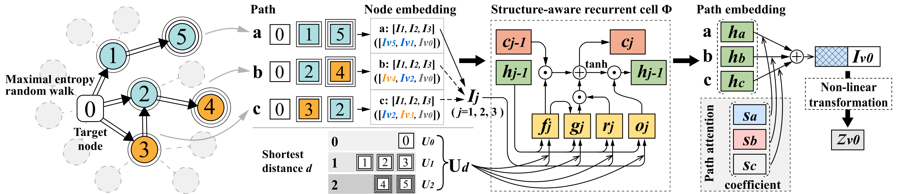
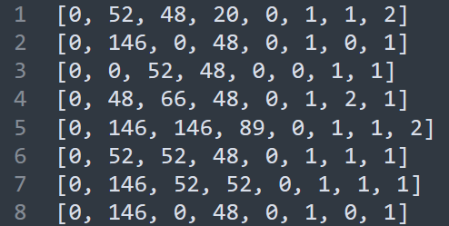
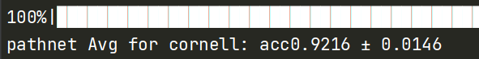
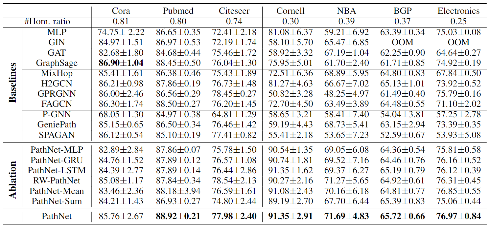

# Beyond Homophily: Structure-aware Path Aggregation Graph Neural Network
## PathNet

PathNet is a structure-aware path aggregation graph neural network that can deal with both homophily and heterophily graphs. 



This implementation of PathNet is based on [Pytorch Geometric](https://github.com/rusty1s/pytorch_geometric) API.

## File folders

`splits`: need to unzipped, contains the split data of "Cora, Cornell, Pubmed and Citeseer".

`other_data`: need to unzipped, contains the data of "Nba, Electronics, Bgp". (The splits are random generated in `run.py`)

`baseline`: contains baseline models.

`draw_figs`: contains the code to draw the results' figs in the paper.

`edge_input`: contains the edge files used in preprocessing.

`preprocess`: contains the preprocessing code.

`synthetic_data`: contains the code for generate the labels of synthetic experiments.

## Setup

This implementation is based on pytorch_geometric. To run the code, you need the following dependencies:

- [Pytorch 1.3.0](https://pytorch.org/)
- [sklearn](https://github.com/scikit-learn/scikit-learn)
- [tqdm](https://github.com/tqdm/tqdm)
- scipy
- numpy
- networkx

## Path Sampler (preprocessing)

This part can be done before training.
To generate the paths for dataset *data_name* (*eg.* Cora). In *gen.cpp*, we change the names of the input and output files to *data_name*, then compile and run *gen.cpp*. The program will generate a file containing all paths.

Compile and run *gen.cpp*  for normal datasets.

```shell
g++ gen_merw.cpp -o gen_merw -g -Wall -O2 -mcmodel=medium
./gen_merw [data_name] [path_num] [path_length]
```

Generated paths example:  `./gen_merw cornell 40 4`



The former 4 ids are paths consist of node_id and the later 4 number indicates the distance of each node on path to the target node.

*Note:* Fill in the data's name at the [data_name], the number of paths at the [path_num], the length of paths at the [path_length]. For example, when using the Cora dataset, `./gen Cora 40 4`. Remember the data_name has to be the same as the file name in the `edge_input` without the postfix`.in`.

If a graph contains too many nodes, the file generated by the above method will be too large and occupy a large running memory. So we provide *gen_epoch.cpp* to generate corresponding paths for each epoch.

Compile and run *gen_epoch.cpp* for large datasets.

```shell
g++ gen_epoch_merw.cpp -o gen_epoch_merw -g -Wall -O2 -mcmodel=medium
./gen_epoch_merw [data_name] [path_num] [path_length]
```
## Main model

### Files
`dataset.json`: contains the path of split datasets.

`save_json.ipynb`: Adjust the paths  in `dataset.json`. (Optional)

`dataset.py`: data usage code (imported in run.py ).

`PathNet_run.py`: main code.

### model usage
Note: 
1. For homophily dataset, the experiment setting follows the github of [Zhu]: https://github.com/GemsLab/H2GCN. The data is already splitted into splits in the `splits` folder. For heterophily dataset, we random split 10 times and the data is stored in `other_data` folder. 

2. Before using the code, please unzip the compressed files in all file folders.

3. The mean accuracy and standard deviation is calculated by the 10 splits of dataset.

```shell
python PathNet_run.py -data=cornell -hid=128
```
Other hyperparameters can be delivered by command line arguments, such as ```-lr=0.005``` and `-data=citeseer`. Other command line arguments can be found in `PathNet_run.py`. The trained model will be saved in 'saved_models' and the performance will be saved in 'results'.

For example: use `python PathNet_run.py -data=cornell ` gets the result in `result_for_cornell`. The performance is also reported in the paper.

### performance example



### Total performance



### Model variants & parameters

Changing the PAGG class can deliver other variants. If you want to try other settings like path length or number of paths, you can first generate the according paths and change the hyperparameters.

## Synthetic experiments
Synthetic graph generators are used to complete the synthesis experiment. At the beginning, all nodes with odd index and even index on the graph are attached with two different features. Synthetic label generators will search all paths with length k for each node (excluding the starting node), and there will be various path patterns. The index of the most path pattern will be selected as the label of the node.

We provide a synthetic label generator for Cora and Citeseer. The two generators will get a file with the same number of lines as the number of nodes in the original network, and each line represents the label of this node in the synthetic graph.

syn_cora:
Compile and run *gen_cora_syn.cpp*

```shell
g++ gen_cora_syn.cpp -o gen_cora_syn -g -Wall -O2
./gen_cora_syn
```

syn_citeseer:
Compile and run *gen_citeseer_syn.cpp*

```shell
g++ gen_citeseer_syn.cpp -o gen_citeseer_syn -g -Wall -O2
./gen_citeseer_syn
```

Contact
If you have any problem, feel free to contact with me. Thanks.

E-mail: yifeisun@zju.edu.cn

### Citation

Please consider citing the following paper when using our code for your application.

```
@inproceedings{yifei2022beyond,
  title = "{Beyond Homophily: Structure-aware Path Aggregation Graph Neural Network.}", 
  author = {Yifei Sun and Haoran Deng and Yang Yang and Chunping Wang and Jiarong Xu and Renhong Huang and Linfeng Cao and Yang Wang and Lei Chen, 
  booktitle={Proceedings of the 31st International Joint Conference on Artificial Intelligence (IJCAI)},
  year = 2022, 
} 
```